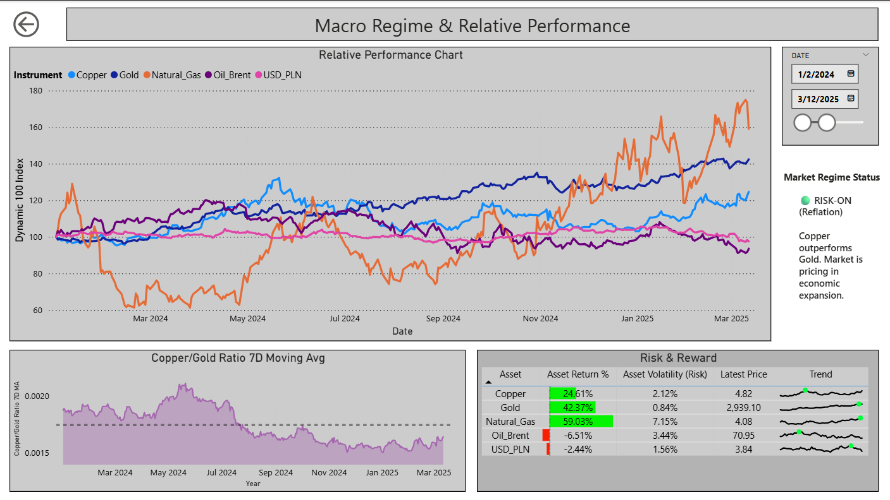
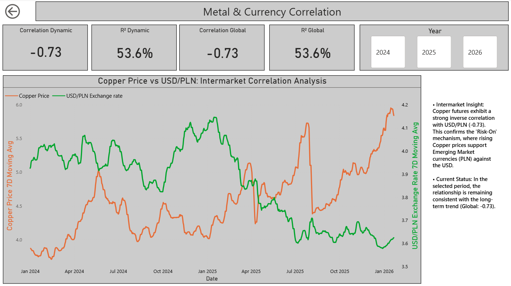
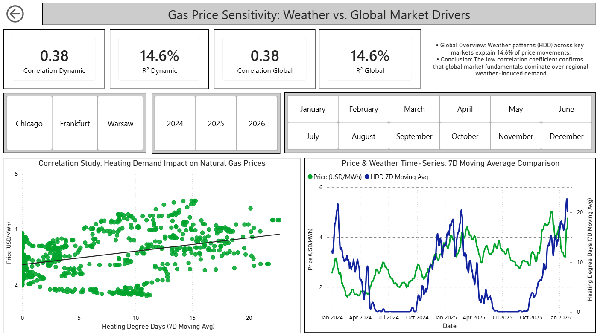
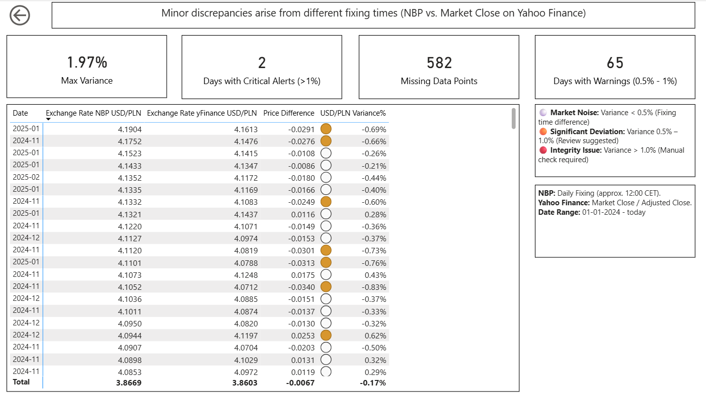
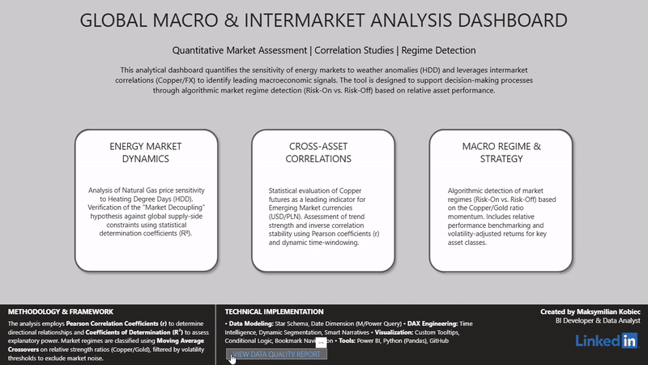
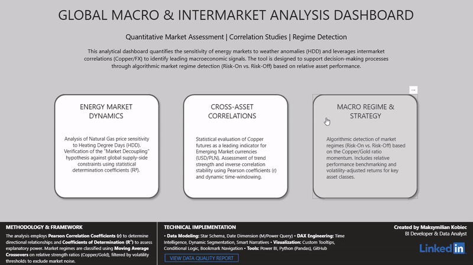
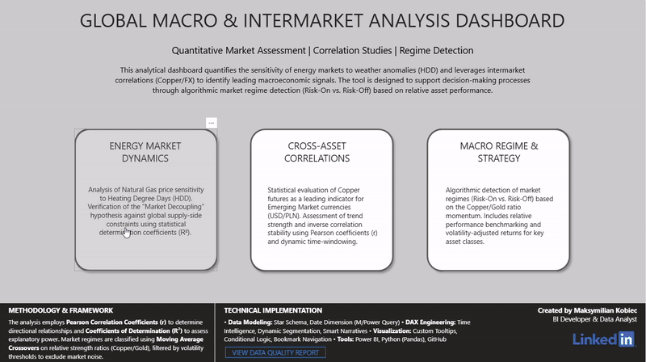
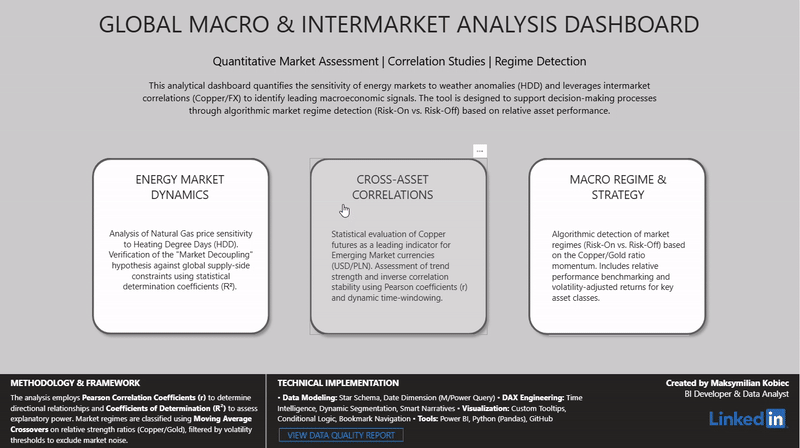

# Global Macro & Intermarket Analysis Dashboard

**Author:** Maksymilian Kobiec
**Tech Stack:** Power BI | Python (Pandas) | DAX Engineering

## 1. Executive Summary
This project serves as an advanced **Quantitative Market Assessment** tool designed to evaluate cross-asset relationships and macroeconomic regimes. Moving beyond intuition, the dashboard leverages statistical correlation and regression analysis to validate market hypotheses.

**Primary Business Goal:** To algorithmically identify market regimes (**Risk-On vs. Risk-Off**) and quantify the sensitivity of energy assets to weather anomalies, supporting data-driven investment decisions.

## 2. Technical Implementation & Architecture
Built with a focus on data integrity, scalability, and statistical rigor.

* **Data Modeling:** Robust Star Schema with a dedicated Date Dimension (M/Power Query).
* **DAX Engineering:** Implementation of complex *Time Intelligence*, *Dynamic Segmentation*, and *Smart Narratives* for automated insight generation.
* **Statistical Analysis:** Native calculation of Pearson Correlation Coefficients (r) and Coefficients of Determination (R^2) within the Power BI engine.
* **Python Integration (ETL):** Custom Python scripts executing directly within Power Query.
    * **Libraries:** `pandas` for transformation, `yfinance` and for data retrieval.
    * **Data Source:** Fetching live historical OHLC data via **Yahoo Finance API** and official exchange rates from **NBP API**.
    * **Refresh Mechanism:** Data is updated dynamically upon every report refresh, ensuring near real-time analysis without manual CSV exports.
---

## 3. Analysis Modules

### A. Macro Regime & Relative Performance
Algorithmic detection of business cycle phases. The model utilizes the **Copper/Gold Ratio** as a leading indicator for global economic sentiment.
* **Mechanism:** When Copper outperforms Gold (relative strength) → Signal for economic expansion (Risk-On).
* **Benchmark:** Performance comparison using volatility-adjusted returns across key asset classes.

### B. Intermarket Correlations (Metal vs. FX)
Analysis of intermarket relationships focusing on the feedback loop between commodities and currencies.
* **Insight:** Validated a strong inverse correlation (**-0.73**) between Copper futures and the USD/PLN exchange rate.
* **Conclusion:** Rising industrial metal prices act as a support factor for Emerging Market currencies (PLN), consistent with the "Commodity Currency" theory.

### C. Gas Price Sensitivity (Hypothesis Testing)
Verification of the hypothesis: *"Does local weather drive global gas prices?"*
* **Methodology:** Linear regression of Natural Gas prices (USD/MWh) against *Heating Degree Days* (HDD).
* **Result:** A low Coefficient of Determination (R² approx 14.6%) suggests a weak linear relationship.
* **Business Implication:** This confirms **Market Decoupling** — global fundamental drivers (supply chains, geopolitics) dominate over regional short-term weather demand.

---

## 4. Data Quality & Integrity Audit
Reliable BI requires trust in data. I implemented an automated audit module comparing exchange rates from two independent sources: **NBP (National Bank of Poland)** vs. **Yahoo Finance**.

* **KPIs:** Tracking `Max Variance`, `Missing Data Points`, and `Critical Alerts (>1%)`.
* **Goal:** To eliminate "Garbage In, Garbage Out" risks before the visualization layer and ensure the integrity of the closing prices used for correlation studies.

---

## 5. User Experience & Interactivity Demos
This dashboard is designed not just for viewing, but for interaction. Below are the key navigation and analytical features.

### A. Custom Navigation System (Bookmarks)
*Demonstrating the app-like navigation experience, allowing seamless switching between Macro, Correlation, and Data Quality views without losing context.*

### B. Dynamic Time Intelligence & Slicing
*Showcasing how the DAX engine recalculates Key Performance Indicators (KPIs) instantly when adjusting timeframes or changing specific market parameters.*

### C. Analytical Drill-Through
*Deep-dive functionality: Moving from a high-level executive summary to granular data points to investigate anomalies.*

### D. Advanced Tooltips & Data Context
*On-hover insights providing additional statistical context without cluttering the main visualization canvas.*

---

## 6. How to Run
1.  Clone the repository.
2.  Open `Global_Macro_Dashboard.pbip` (Power BI Project format).
3.  Refresh data (requires a configured Python environment with `pandas` and `yfinance` libraries).
